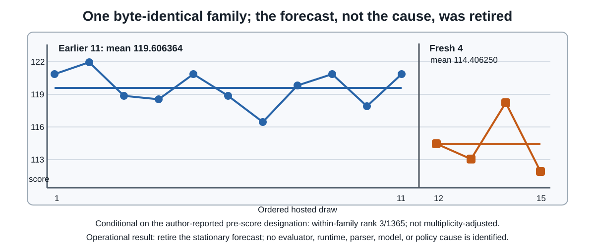
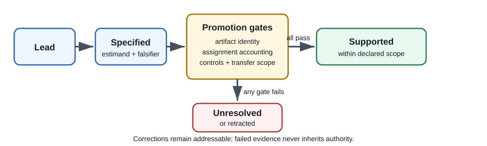
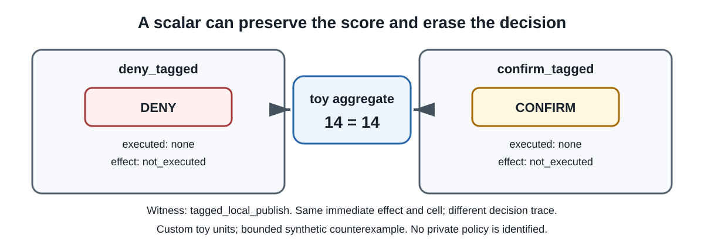

# Two Guardrails, Two Orders

## What it costs to make a benchmark score mean something

**Status:** integration candidate; competition closed 2026-09-01T23:59:00Z  
**Scope:** competition methodology, synthetic demonstrations, and benchmark-design lessons  
**Author/team attribution:** AL Najafi (solo)  
**License:** MIT (`LICENSE.txt` in the repository linked in §9)  

## Abstract

A replay-based agent-security benchmark scores the same executed artifact twice, once
against a permissive public guardrail whose source is published, once against a
stricter private one competitors never see. After the close we read our two final
selections. One held its score almost unchanged, at `25.800` public and `25.815`
private. The other fell from `104.035` to `0.300`, a **99.7% collapse**. Same bytes,
same replay harness, same scoring predicates. What differed is the guardrail deciding
which tool calls succeed. **The public ranking of the two inverted under the private
one.** A participant ranking these candidates on public feedback would have ranked
them backwards against the instrument that decided the competition. We make no claim
about why. §5 weighs four candidate mechanisms and separates none of them. One is unlikely at
this magnitude, on a single artifact. Of the three that remain, one would change the
lesson.

A synthetic workbench sharpens the measurement failure into something a builder can
act on. Across a declared eight-policy family, all 28 pairs separate on the full
recorded case signature. Delete the recorded decision label and 2 of those 28
collapse. In both of those pairs the proposed actions, executed-action records,
immediate effects, and stable cells are identical on every released case. Those
policies do differ behaviorally, on a re-proposal after confirmation that the corpus
never exercises. So a suite must **either exercise the deferral branch or record the
decision label**. A suite that does neither turns a refusal and a deferral into the
same row.

From these we draw what a benchmark can expose without revealing its hidden defense:
content-addressed artifact identities, counts by phase instead of one scored
denominator, a declared reducer over repeated evaluations, a correction ledger, and
the decision label itself. Each is cheap, and each removes a class of unfalsifiable
claim from the discourse around the benchmark.

Most of it came out of a protocol that turned on us first. It made us retire our own
evaluator-change story, preserve every observation, and decline to name a cause,
because the evidence supported a smaller claim than the one we wanted.

## 1. The correction

We tracked one byte-identical public submission family across 15 draws. The first
eleven had mean `119.606364` and sample standard deviation `1.618804`. A fresh batch
of four (designated together with the family before the four public scores were read)
had mean `114.406250`, a shift of `-5.200114`, with sample standard deviation
`2.744122`.

| Repeat-family segment | Draws | Mean | Sample SD | Operational decision |
|---|---:|---:|---:|---|
| Earlier sequence | 11 | `119.606364` | `1.618804` | Historical forecast before the fresh test |
| Designated fresh batch | 4 | `114.406250` | `2.744122` | Retire the forecast; do not name a cause |

Conditional on that pre-score designation, and **under a narrow null that all 15
values are exchangeable in time**, 3 of the 1,365 four-subsets, including the observed
allocation itself, have a mean at least as low. Two others are strictly lower. The
exchangeability clause is doing the statistical work here, not the designation. What
the designation rules out is choosing the window after seeing the scores;
exchangeability is what licenses treating all `C(15,4)` allocations as equally likely.
Because the fresh batch occupies the latest four positions in the released
time-ordered sequence, that is a stationarity assumption and not a randomization
guarantee. A reference class of contiguous four-windows instead of all subsets moves
the fraction from `3/1365` to `1/12`.

Deleting each score in turn and recomputing moves the exact fraction between `2/1001`
and `3/364`. Every recomputed value stays below 1%. That sensitivity check does not
repair the timing claim, campaign-wide multiplicity, dependence, heavy tails, or
stationarity.

One item of provenance is checkable and the rest is not. The released record declares
a score bank of `98070` bytes with SHA-256 `ec42a33f…`. An author-held file with
exactly those bytes and that digest is dated `2026-08-31T13:49Z` in the author's
filesystem, **18 hours 39 minutes before the last fresh score became visible**. The
digest fixes the contents of the prior-eleven group. The date does not: a filesystem
timestamp is author-controllable, so it corroborates intent rather than proving order.
A second artifact, an allocation controller dated 18 hours 50 minutes before that same
score, hard-codes the one-plus-four split in source, and its transaction stopped after
one send. Both artifacts carry the same evidentiary weight, and it is weaker than a
digest. The
record's other declared digest, a `6288`-byte preregistration, **no longer resolves**.
That file has since been appended to and now differs in size and hash. A record that
invites verification has to survive being verified, and this half did not. None of it
establishes that *this particular family and window* were chosen blind. That
designation is author-reported, and is the premise the ledger's own falsifier targets.

One disclosure bears on how the title reads. This competition did announce an
evaluator update publicly on 2026-06-23, stating that existing submissions would not
be rescored [Official-Evaluator-FAQ], the same host post §5 relies on. It predates every draw discussed here by more than two months, so it does
not explain this shift. A reader who remembers that post still deserves to have it
named. The story we retired was our own inference about a
*further*, unannounced change, and we found no evidence for one.

The protocol produced an asymmetric outcome. Retire the stationary forecast, preserve
all 15 outcomes, and name no cause. One cluster cannot separate an evaluator change, a
policy change, runtime variation, model variation, parser behavior, dependence, or a
heavy-tailed draw process. We could not distinguish those, so we did not claim to,
including (and especially) the evaluator hypothesis we found most attractive.



<!-- claim:C-CAMPAIGN-CORRECTION-001 -->

Unless best-of-`n` is the prespecified estimand, a maximum over repeated noisy
evaluations is selection-biased and is not an unbiased estimate of expected
configuration performance. Reports should preserve the complete repeat lineage,
draw count, and prespecified reducer rather than presenting the best draw as
evidence for a mechanism.

<!-- claim:C-METHOD-NOISY-MAX-001 -->

## 2. The protocol that forced it

A hidden-defense benchmark invites one seductive mistake, which is to treat every
score as a measurement of the hidden defense. Scores also reflect artifact drift,
completion filtering, serialization, stochastic variation, or an aggregate that erases
the policy behavior of interest. The protocol is an ordered promotion gate. It says nothing about how to
search. Candidate generation (prompt search, fuzzing, throughput engineering)
proposes. This order decides what an observation is allowed to establish.

1. **Bind identity.** Which exact bytes ran? A favorable number computed on a
   different artifact is not a result.
2. **Account for assignment.** Which assigned trials entered the primary endpoint?
   Completers are a post-treatment selection.
3. **Demand a control.** What negative and positive controls ran, and did the
   positive one fire?
4. **Represent competing mechanisms.** What else explains this, and which
   observation would separate them?
5. **Interpret last**, and only within the scope the first four gates permit.

Each promoted claim carries an evidence class, a scope, a falsifier, and artifact
anchors resolved against a hash-bound manifest. A released verifier checks
mechanically that every claim resolves to a declared anchor and that the anchor is
present, so an anchor cannot silently disappear between drafts. It does not check that
the anchor supports the claim. §9 reports what a passing run does and does not
establish, because we attacked it and the answer is narrower than a green result looks.
The order is an author protocol. We offer it because it
forced the correction in §1 against our preference, and it is falsified by any
documented benchmark context in which applying these gates in this order is
counterproductive.

<!-- claim:C-METHOD-001 -->

| Evidence class | Protocol decision | Permitted conclusion |
|---|---|---|
| Favorable metric under changed artifact bytes | Reject the comparison | No treatment claim |
| Completion-only gain of four | Restore all assigned trials | Declared ITT difference is zero |
| Equal toy aggregates, different decision traces | Require pairwise witnesses | Aggregate equality does not identify behavior |
| Designated fresh repeat batch, unusually low | Retire the forecast without naming a cause | Historical model strained; mechanism unidentified |



## 3. Three counterexamples, briefly

The workbench is standard-library-only, hash-pinned, deliberately small, and not a
sample of real defenses. It exists so that each failure mode can be reproduced and
mutation-tested.

**Identity.** A favorable metric computed after the executed artifact's bytes
changed is rejected before it is compared. Version history is useful context, but it
is not artifact identity.

**Assignment.** Sixteen trials, eight per arm. Among completers the treatment arm
leads by exactly `4` points of the toy aggregate. Restoring the four assigned non-completers, the declared
intention-to-treat difference is exactly `0`. The gain was attrition.

**Aggregation.** Eight toy policies over seven cases produce two aggregate ties. For
those two tied pairs the recorded behavior is identical on every released case, and
only the decision label separates them. §4 makes that precise and draws the
coverage lesson from it.

The three above sit inside a wider map of five tool-agent layers. Each layer is mapped
to the receipt that isolates it, so a reader can see which instrument answers which
confound without taking the protocol on trust. The remaining two layers are covered by
declared semantics rather than a worked example:

| Tool-agent layer | Confound it introduces | Receipt or control that isolates it |
|---|---|---|
| Executed artifact | Version drift between runs | Content-addressed identity, compared before any metric |
| Trial assignment | Post-treatment selection on completers | Assignment-complete endpoint with phase counts |
| Environment state | Leakage between trials | Declared state lifetime and reset semantics |
| Aggregation | Distinct behaviors compressed to one scalar | Pairwise distinguishing witnesses |
| Repeated evaluation | Maximum mistaken for expectation | Declared reducer and full draw lineage |

The workbench is mutation-tested. The suite fails if the harness is altered to
baseline-allow, baseline-deny, take a wrong action, share state across trials, turn
a witness into a no-op, return a stale result, or change one byte of input. Those
mutations are the reason the passing result means anything, and they run under `-O`
as well as normally.

<!-- claim:C-SYNTH-IDENTITY-001 -->
<!-- claim:C-SYNTH-ITT-001 -->

## 4. What the scalar hides, and what the label carries

Take the declared eight-policy family over seven recorded cases. Define a case
signature as the full recorded result: the case identifier, the points, the cells,
and the complete trace of proposed action, executed action, immediate effect, stable
cell, and recorded decision. All `C(8,2) = 28` pairs differ on at least one case
signature, and exhaustive search over all 35 three-case subsets finds exactly one
suite that separates all eight policies. No one- or two-case suite does. Exactly one three-case suite does it, so the minimum
suite is unique.

Now delete the decision label from the signature and repeat the search. This is what
an observer sees who can watch what an agent proposed, what it executed, what
changed, and where, but cannot see what the guardrail called it. The block below is
derived by hand from the released fixtures; `reproduce.py` does not emit it (§9).

```
label-free equivalence classes over the full 7-case corpus:
  allow_all
  deny_tagged, confirm_tagged                <- collapsed
  sanitize_tagged
  provenance_gate
  recipient_gate, confirm_other_recipient    <- collapsed
  once_per_candidate
=> 6 classes from 8 policies.
   No suite of ANY size separates all 8 without the label.
```

Twenty-six pairs still separate. Two do not. On their distinguishing cases those two
pairs have identical proposed actions, identical executed-action records (both
null), identical immediate effects (`not_executed`), and identical stable cells.
The only differing key in the entire record is the decision, `DENY` versus a
`CONFIRM` that no released case re-proposes.

The two collapsed pairs are **not** behaviorally identical policies. Under the policy
code a confirmed re-proposal executes under `confirm_tagged` and is refused under
`deny_tagged`, a different executed action and a different effect, separable with no
label at all. The seven-case corpus simply never re-proposes *after a confirmation*
(no released event carries a confirmed flag), so the branch that would separate them
is never exercised.

The result is therefore scoped to corpus coverage, and that is what makes it
actionable. Within this corpus the recorded label is *necessary* to separate those
two policies. A corpus containing one re-proposal-after-confirmation case would
separate them behaviorally and the label would be redundant. So the lesson for a
benchmark builder is a disjunction, not a prohibition:

> **Either exercise the deferral branch, or record the decision label.**
> A suite that does neither cannot tell a refusal from a deferral, not because the
> distinction is unobservable, but because that suite declined to observe it.

The competition SDK turns out to exhibit a scoped version of this, and a reader can
check it in about fifteen lines. Its guardrail returns one of four decisions
(`ALLOW`, `DENY`, `CONFIRM`, `SANITIZE` in `aicomp_sdk/guardrails/base.py`), but the
scored tool record carries no decision field, only a success boolean and a free-text
`error` string in `aicomp_sdk/core/trace.py`, into which a block is written as the
prefix `denied:` or `confirm_required:`. In the version we read, `aicomp-sdk` 1.4.2 from PyPI, the attack predicates gate on
that boolean and none of them reads the string; the grading gateway discards any candidate that produced
no predicate before a cell signature is formed. So a candidate whose only guardrail
interaction is a block scores identically whether it was denied or merely deferred.
On the defense track the collapse is unconditional. Both prefixes fold into one
false-positive counter by a single tuple-prefix test in `aicomp_sdk/evaluation/ops.py`,
which is the only channel by which either reaches the defense score.

Two limits keep this honest. The label does survive in one place, the cell
signature's `guardrail_blocks` field, folded into the novelty hash. But it survives
only for candidates that independently cleared the predicate gate, and only while the
block stays inside that signature's three-event window. `SANITIZE` is not a
non-execution at all, because it rewrites the arguments and proceeds, and so it
scores like `ALLOW`. This is a derivation a reader can run against the published SDK
(`pip install aicomp-sdk==1.4.2`), not a receipt we hold. It is a reading of one
version, not a proof about every predicate the package may ever contain.

This is a statement about test-suite design. It discovers nothing about any hidden
policy, and it is cheap to act on and easy to check.



<!-- claim:C-SYNTH-POLICY-001 -->
<!-- claim:C-SYNTH-WITNESS-001 -->
<!-- claim:C-SYNTH-MUTATION-001 -->

## 5. The two guardrails ranked our artifacts in opposite orders

Everything above is a synthetic demonstration or a statement about our own inference
discipline. This section is the one place we can put a number on the note's central
claim using the real system, because the competition ran the experiment for us.

The captured Evaluation page describes a private guardrail "not accessible to
competitors" [Official-Evaluation]. The premise §5 needs is stronger than that page
states, so we cite its actual warrant, the organizers' evaluator FAQ. It says the
attack algorithm "is executed exactly once per model during live exploration… It is
not run a second time for Private Leaderboard scoring", and that the candidate
sequences "are replayed in fresh environments against both the Public Guardrail and
the Private Guardrail" [Official-Evaluator-FAQ]. That establishes one generation phase and two guardrail replays of the
same candidates, scored twice.

Two limits bear on that premise. The first is that the replays are separate
executions in fresh environments, so the guardrail difference and the replay draw are
not experimentally separated here. The second is that the competition Rules elsewhere
describe a public and a private *test set*, wording that on its own would suggest a
row split instead of a guardrail swap. We rely on the FAQ, and a reader who reads the
Rules alone is entitled to a different reading.

After the close we read the authenticated submissions endpoint for our two final
selections:

| Selected artifact | Public guardrail | Private guardrail | Change |
|---|---:|---:|---:|
| Selection A (exfiltration-shaped) | `104.035` | `0.300` | **-99.7%** |
| Selection B (mail-shaped) | `25.800` | `25.815` | +0.06% |

(Submission identifiers are deliberately omitted; the release boundary excludes them
and the result does not depend on them.)

One artifact retained essentially all of its score. The other retained three tenths
of a point out of a hundred and four. Same bytes, same replay harness, same scoring
predicates. What differed is the guardrail deciding which tool calls are permitted to
succeed, which is the point, since that guardrail is the thing a competitor cannot
see.

The result that matters is not that the private guardrail is stricter, which was
announced in advance. What matters is that **the public ranking of these two
artifacts inverted under the private guardrail**. Two artifacts whose public scores
differ by a factor of four have private scores that differ by a factor of eighty-six,
in the opposite order. A participant ranking these two candidates by public score
would have ranked them backwards against the instrument that decided the competition.

Applying our own gate 4 to ourselves, the competing explanations are not exhausted,
and one of them would change the lesson:

| Mechanism | Fits the data? | What would separate it |
|---|---|---|
| The private guardrail responds differently to different artifacts | yes | artifacts spanning several predicate mixes, not two |
| **A single predicate is blocked outright**, artifact-independently. Our stronger artifact scored almost entirely through one route, so closing that route zeroes it and leaves the other untouched | **yes, equally well** | a third artifact whose public score comes from a *different* predicate mix |
| The residue is a floor, not a graded response, so the collapse carries roughly one bit (route blocked / not blocked) rather than a magnitude | yes | replicates spanning intermediate predicate mixes |
| Replay variation, since the two boards are separate executions in fresh environments | unlikely at this magnitude, but observed on one artifact only | byte-identical replicates scored under both guardrails, which we do not have |

We cannot separate these. In particular the second row is a different claim from
the first, with a different consequence for a builder. If one route is simply closed, the public-to-private map is **structured
and learnable** and not capricious, and a benchmark builder should draw a different
conclusion than if the instrument were artifact-sensitive. We have no control arm
that distinguishes them, which by our own gate 3 means the mechanism stays unnamed.

What survives all four rows is the narrow claim, and it is the one we make. A public
leaderboard scored against a permissive guardrail **can** invert the ordering the
hidden one produces, and here it did, by a margin no participant could have read off
public feedback. That is an existence result from two artifacts chosen by one team.
It does not establish a distribution, a typical magnitude, or the identity of the
private guardrail.

A reader who compares this section against §1 will find an apparent contradiction,
and it is worth resolving because it corroborates the premise. §1's family has a
sample standard deviation of `1.618804` on a mean of `119.606364`, a coefficient of
variation near 1.35%, which applied to row B's `25.800` would predict roughly `0.35`
points of spread. Row B's two scores differ by `0.015`, well inside that predicted spread. One pair is
weak evidence, but it points the right way. The two sections are not in conflict. §1's dispersion is
measured *across fifteen separate submissions*, each with its own generation phase,
whereas the two scores in row B come from **one** generation phase replayed twice.
The variance that dominates §1 is generation variance, and §5's pair does not
contain any of it. That is what the organizers' FAQ describes, so the arithmetic is
consistent with the premise rather than a strain against it. Row A's collapse is also
far larger than any replay difference we observed, though we observed replay stability
on one artifact only, so this weighs against a noisy draw without ruling one out.

One disclosure cuts both ways. These two artifacts
were not a random pair. They were selected before the close as a deliberate straddle,
because we had assigned meaningful probability to the branch in which the
exfiltration-shaped artifact fails privately. That selection was **locked before the
private values could exist**, so the comparison could not have been chosen after
seeing its outcome. But it also means the pair was picked to span this contrast, so
the *frequency* of such inversions in the wider field is not something these two
points can speak to. It also undercuts one thing we might otherwise have said. We
were not, in fact, optimizing blindly against the permissive guardrail. We read the
published guardrail source and hedged.

For benchmark designers the implication is concrete and uncomfortable. The only
per-submission gradient is a permissive-guardrail score, and that is the gradient
search will follow. A careful participant can partly escape it, because the public
guardrail's source is published, so its behavior can be read rather than inferred,
and we did so. But reading source is not feedback, and
it cannot price the hidden guardrail. A benchmark that wants search directed at the
hidden objective has to leak something about it: a coarse private signal, a
validation split, a rejection reason, or selective release of the kind The Ladder
formalizes [Ladder]. The alternative is to accept that its public ranking may order
artifacts differently from the instrument that decides it. Our own campaign is a
worked example of the cost. That campaign finished 52nd of 4,186 teams on the
private board, a standing produced entirely by the artifact that did not collapse. The
post-close record shows 251 submission attempts from this team, of which 89 completed,
spent climbing a board that,
for our stronger artifact, ranked it above one the private guardrail ranked far
below.

<!-- claim:C-GUARDRAIL-DIVERGENCE-001 -->

## 6. Deciding without identifying

Non-identification is not paralysis. Under a hidden guardrail you can still order
actions by what the evidence licenses, provided you say which signal licenses which
action and which does not.

| Signal | What it licenses | What it does not license | Search action |
|---|---|---|---|
| Score change with frozen artifact bytes | A measured effect within scope | A mechanism story | Continue the declared arm |
| Score change with drifted bytes | Nothing | Any comparison | Rebuild and re-measure |
| Completer-only improvement | A descriptive statement | An effect claim | Restore assigned trials |
| Equal aggregate | Nothing about behavior | Policy equivalence | Build a distinguishing case |
| Designated repeat batch, strained forecast | Retiring the forecast | Naming a cause | Preserve outcomes, widen the next test |

<!-- claim:C-METHOD-DECISION-001 -->

## 7. What benchmark builders can expose without revealing the defense

None of the following discloses a hidden policy, yet each removes a class of
unfalsifiable claim from the discourse around the benchmark:

- content-addressed evaluator and model identities, so participants can bind results
  to executed bytes
- explicit state-lifetime and reset semantics between trials
- counts by phase (assigned, executed, completed, filtered) and not a single scored
  denominator
- **either a case that exercises the deferral branch, or the recorded decision label
  carried into every scored channel**. §4 shows a suite doing neither cannot
  separate a refusal from a deferral, and the label is much the cheaper of the two.
  Recording it once is not sufficient. In this benchmark the label reaches the
  novelty hash, but the `DENY`/`CONFIRM` distinction survives into neither the
  predicate gate nor the defense score, where both prefixes merge into one counter. A
  label only some scored channels can see leaves the others unable to tell the two apart
- a **correction ledger** naming which claims were retired, when, and on what
  evidence, so that a reversal leaves a record of its own
- a declared reducer over repeated evaluations, so a maximum is not mistaken for an
  expectation
- **a documented rule for combining multiple final selections.** No authenticated
  official source we found documents the reducer *in advance*, so a participant
  choosing selections cannot know at decision time whether a best-of, a mean, or a
  per-selection rule will apply. Our own final standing is consistent with a
  best-of rule, since the reported result equals the higher of our two private scores
  and is far above their mean. But one team's outcome is an observation, not a
  specification, and it arrives after every decision it would have informed. The
  recommendation is about timing as much as disclosure. A reducer documented only
  implicitly, by the results, is documented too late to be used.

<!-- claim:C-NONCLAIM-REDUCER-001 -->

<!-- claim:C-METHOD-BUILDER-001 -->

## 8. Relation to prior work

Five contemporaneous competition notes map the observable attack surface:
source-level predicate reachability [JED-Xander]; a source-grounded public ablation
study that also reports two deliberately mechanism-diverse final selections and
argues for mechanism-diverse portfolios [JED-Radiant]; a budget-aware validation-fill attack loop with an explicit
replay-time deadline [JED-Pilkwang]; throughput, repeated-evaluation noise, and
controlled negative results [JED-Cleanor]; and bounded search under coarse feedback
with explicit evidence classes and claim limits [JED-oNanachii].

We claim no priority for publishing a retraction, and it is worth saying why,
because we drafted such a claim and then found it false. Several notes in this
competition carry dated public self-corrections. [JED-Xander] records revising two
of its own sections after its own results contradicted an absolute claim it had
made. Retraction is something this field already does, so we claim no
credit for it.

Our §5 needs the same honesty. [JED-Xander] reports the public-versus-private
divergence at **field scale**, across the whole leaderboard, from a source-level
analysis published before the close. That is the stronger form of the observation.
What our §5 adds is narrower and complementary, a **within-team paired**
measurement in which both artifacts come from one generation phase, so the comparison
isolates the guardrail from the generation variance that dominates a cross-team
board. The §1 dispersion figures are what let us say that. They are the reason row
B's tightness is informative and not lucky. A field-scale result establishes that the
divergence is common. A paired one constrains what it can be attributed to.

[JED-Radiant] is nearer still, and the difference is worth stating precisely.
That note also selected two finals that deliberately differed in mechanism, and
read both boards after the close. Both of its selections scored zero privately, so
it reports a **collapse** of both routes. Ours reports an **inversion**: one
selection held at `25.815` while the other fell to `0.300`, so the public ordering
of the pair reversed. Collapse and inversion carry different lessons for a
benchmark designer. A collapse says the disclosed route does not transfer. An
inversion says the public gradient can actively mislead a participant about which
of two artifacts is better.

Prior work supplies the ingredients. AgentDojo builds prompt-injection evaluation as
an extensible environment, not a static list [AgentDojo]. InjecAgent reports
both success among valid outputs and success across all test cases, an explicit
denominator choice that anticipates our assignment gate [InjecAgent]. The Ladder
formalizes leaderboard accuracy under adaptive submissions with selective score
release [Ladder]. The Reusable Holdout controls reuse through a differentially
private access mechanism [Reusable-Holdout], and the Generic Holdout uses binary
feedback and a stopping rule [Generic-Holdout]. Those guarantees require mechanisms
not instantiated here, and a hidden final evaluator resembles a holdout without
inheriting its theorems. CONSORT 2025 supplies the reporting discipline for the
assignment gate [CONSORT-2025]. Active automata learning supplies the habit of
binding distinguishability to explicit witness cases [Small-Test-Suites].

We do not claim novelty for any ingredient. What we have not seen combined elsewhere
is a promotion order that is executable and checked, applied to a live hidden-defense
benchmark, together with a corpus-scoped non-identification result that names a
concrete field a builder can record.

## 9. Reproduction

The complete payload is public, under MIT:

**[github.com/knightynite/jed-working-note](https://github.com/knightynite/jed-working-note)**, published by the author
(GitHub `knightynite`, AL Najafi).

Verify the release archive, not a clone. The verifier is a whole-tree scan. It
requires the directory to contain exactly the manifested payload and nothing else, so
that no unlisted file can ride along unnoticed, and it therefore refuses to certify a
working tree carrying version-control metadata. The repository exists so the payload
can be browsed and diffed. The archive is the artifact the receipt describes.

From the release root, one standard-library command checks the manifest and
evidence, reproduces both result sets, runs the synthetic and release-contract
tests, validates figures and claim/citation bijections, and emits one receipt. It
requires **CPython 3.12 exactly**, and refuses to run on any other minor version:

```text
python -I -B scripts/verify_release_v5.py
```

The explicit audit matrix, normal and optimized:

```text
python -I -B    synthetic_workbench/scripts/reproduce.py --check synthetic_workbench/EXPECTED_RESULTS.json
python -I -B -O synthetic_workbench/scripts/reproduce.py --check synthetic_workbench/EXPECTED_RESULTS.json
python -I -B    -m unittest discover -s synthetic_workbench/tests -v
python -I -B -O -m unittest discover -s synthetic_workbench/tests -v
python -I -B    scripts/reproduce_campaign_correction.py --check EXPECTED_CAMPAIGN_SUMMARY.json
python -I -B -O scripts/reproduce_campaign_correction.py --check EXPECTED_CAMPAIGN_SUMMARY.json
```

Expected headline results emitted by those commands: 8 toy policies over 7 cases,
28/28 pairwise witnesses, a three-case minimum distinguishing suite, completion-only
delta `4` versus declared ITT delta `0`, and campaign exchangeable rank `3/1365`
under its stated null. The checks run under `-O` as well as normally, and the code
raises instead of asserting, so optimization does not silently remove a gate.

Three results in §4 are **derived, not emitted**, and we say so rather than let a
reader assume the harness produced them. The third is the SDK reading above, which a
reader reproduces against the published package and not against anything we ship. The
other two, the label-free ablation (26 of 28 pairs surviving deletion of the decision
key, six equivalence classes, no separating suite at any size) and the *uniqueness*
of the three-case suite, are not computed by `reproduce.py`, which reports a minimal
suite without proving it the only one. Both follow from the released fixtures in
roughly fifteen lines. Rebuild each case signature with the `decision` key removed,
then re-run the same pairwise and subset searches. We state them as derivations a
reader can check. We hold no receipt for either. §1's contiguous-window fraction
(`1/12`) and §5's coefficient-of-variation arithmetic are likewise computed from the
released values rather than emitted by the checkers.

### What a passing run does not establish

We attacked our own verifier before publishing it, because a note arguing that a
scalar can hide a decision should not ship a green check that hides the same way.
A passing run establishes payload integrity: that every file is the file the manifest
names, that both reproducers regenerate their expected outputs byte for byte under
`-O` and normally, that the figures carry no active content, and that every claim
resolves to a declared anchor.

It establishes nothing about whether the content is true. The manifest generator is a
pure function of the tree, and verification recomputes it, so an author who edits a
value and regenerates the manifest passes. Under adversarial test we inverted this
note's headline private score while leaving the derived percentages and the prose
contradicting it, redrew a figure's data series so the chart contradicted its own
caption, and repointed a reference to an unrelated paper. Each change passed. The
anchor check resolves a JSON path or a whitespace-normalized substring, so it confirms
that an anchor is present, not that the anchor supports the claim. The declared
non-claims in §10 are author commitments a reader must check against the text; the
verifier does not test them, and their ledger entries now say so.

The three bindings that did resist attack are the synthetic workbench, the campaign
fixture, and the pinned campaign statistics, each of which is re-derived byte for
byte from its inputs rather than compared against a stored digest. That is the
difference between a hash and a computation, and it is the same lesson as §4: a
recorded value that nothing re-derives is a value nothing checks.

Artifact identities live in the payload manifest, not inline here, so this paragraph
never has to be kept in sync with the files it describes. The published archive is an
integration candidate. It carries the manifest, the evidence records, and the
verifier, and the receipt that command prints is what certifies it. The attestation
and approval records that a final release binds are not part of this archive, and the
manifest's status field records the archive's integration-candidate status.

## 10. Responsible disclosure boundary

This note describes the competition benchmark and a synthetic workbench. It contains
no attack prompts, no private traces, no credentials, and no instructions for
attacking real systems. Two distinct sources are cited and should not be conflated.
The scoring rules and metric definition come from the dated capture of the official
Evaluation page [Official-Evaluation], while every score value is the author's own
submission outcome, read from the authenticated submissions endpoint. Those values
are of two kinds and §5 depends on the distinction. The fifteen campaign draws in §1
are public scores, and the four values in §5 are the author's own public and
**private** scores for the author's own two selected submissions, which became
readable only after the close. No competitor's outcomes, public or private, are
reproduced, and no private score belonging to anyone else is inferred.

<!-- claim:C-OFFICIAL-001 -->

Four explicit non-claims. Nothing here infers or approximates the private guardrail,
and no private score is reconstructed.

<!-- claim:C-NONCLAIM-PRIVATE-001 -->

Nothing here compares competitors or ranks their methods; other participants' notes
are cited at the level of their stated propositions only.

<!-- claim:C-NONCLAIM-COMPETITOR-001 -->

Nothing here amounts to a causal deployment claim, and **no causal deployment claim**
is made about any production agent, guardrail, or vendor system.

<!-- claim:C-NONCLAIM-DEPLOYMENT-001 -->

There is also **no claim of transfer to real systems**. The synthetic policy family
demonstrates a measurement failure mode, not a property of any deployed defense.

<!-- claim:C-NONCLAIM-TRANSFER-001 -->

## 11. Limitations

The workbench is small and synthetic. Its policy family is not a statistical sample
of real defenses, and its unit is a custom toy aggregate, not the competition scoring
formula. Pairwise distinguishability on seven cases does not imply completeness, and
a minimum suite for this family need not transfer. The ITT example illustrates
selection bias. It does not prescribe a universal failure score. Content hashes
establish identity, not authorship, correctness, or causal isolation. The campaign
correction rests on a hash-bound baseline that fixes the prior-eleven group before
the fresh scores existed, on a still author-reported designation of which family and
window were chosen, and on an exchangeability assumption the released data lets
a reader reject.

§5 carries limitations of its own, and they are sharper than §1's. It rests on two
artifacts from one team, deliberately selected before the close to straddle the one it
reports, so it establishes existence and says nothing about frequency or typical
magnitude. It has no control arm separating the guardrail difference from the
separate replay execution. Of the four candidate mechanisms §5 weighs, none is
separated. Replay variation is unlikely at this magnitude but rests on one artifact.
One of the others, a single blocked route, would make the public-to-private map
learnable rather than capricious. Its two
private values are also readable only from the author's own authenticated account. A
third party can verify the shipped receipt's internal consistency and the better of
the two scores from the public final standing, but cannot independently re-read the
collapsed artifact's private score, because the platform publishes only a team's best
selected submission. That is a real verifiability gap in the note's most striking
result.

Most importantly, nothing here identifies the inaccessible private guardrail. The
method is built to stay useful when that answer never arrives.

## 12. Conclusion

Agent-security benchmarks test more than model behavior. They test whether a
measurement process can resist its own incentives. Public scores reward searching;
hidden defenses reward humility about what the search established.

So freeze the bytes, keep assigned failures in the endpoint, and demand a working
control. Record the decision, not just the action. When the evidence shrinks, let the
claim shrink with it, including when the claim you have to give up is the interesting
one.

Optimization survives all of this. It becomes a result someone else can trust.

## Contributions

I am the sole author. I ran the submission campaign these results come from, made
every submission and final-selection decision including the two-artifact straddle
§5 reports, set the evidence standards the note applies, decided which findings were
promotable and which were retired, wrote this note, and am responsible for it.

## References

- [AgentDojo] E. Debenedetti et al., "AgentDojo: A Dynamic Environment to Evaluate
  Prompt Injection Attacks and Defenses for LLM Agents," NeurIPS 2024 Datasets and
  Benchmarks Track, 2024, https://arxiv.org/abs/2406.13352.
- [InjecAgent] Q. Zhan et al., "InjecAgent: Benchmarking Indirect Prompt Injections
  in Tool-Integrated Large Language Model Agents," Findings of ACL 2024, 2024,
  https://arxiv.org/abs/2403.02691.
- [Ladder] A. Blum and M. Hardt, "The Ladder: A Reliable Leaderboard for Machine
  Learning Competitions," ICML 2015, PMLR v37, pp. 1006-1014,
  https://arxiv.org/abs/1502.04585.
- [Generic-Holdout] P. Nakkiran and J. Błasiok, "The Generic Holdout: Preventing
  False-Discoveries in Adaptive Data Science," 2018,
  https://arxiv.org/abs/1809.05596.
- [Reusable-Holdout] C. Dwork et al., "The reusable holdout: Preserving validity in
  adaptive data analysis," Science 349(6248):636-638, 2015,
  https://doi.org/10.1126/science.aaa9375.
- [CONSORT-2025] S. Hopewell et al., "CONSORT 2025 statement: updated guideline for
  reporting randomised trials," BMJ 389:e081123, 2025,
  https://www.bmj.com/content/389/bmj-2024-081123.
- [Small-Test-Suites] L. Kruger, S. Junges, and J. Rot, "Small Test Suites for Active
  Automata Learning," TACAS 2024, https://arxiv.org/abs/2401.12703.
- [JED-Xander] Xander (`canqiang`), "The Scored Attack Surface Collapses to a Single
  Predicate," 2026,
  https://www.kaggle.com/writeups/canqiang/the-scored-attack-surface-collapses-to-a-single-pr.
- [JED-Radiant] `radiant-allomancer`, "Public Throughput, Private Zero: What a
  Source-Level Guardrail Audit Taught Us," 2026, revision of 2026-09-02 read on
  2026-09-03,
  https://www.kaggle.com/writeups/radiantallomancer/reading-the-objective-from-source-a-throughput-bo.
- [JED-Pilkwang] Pilkwang Kim, "AI Agent - Working Note," 2026,
  https://www.kaggle.com/code/pilkwang/ai-agent-working-note.
- [JED-Cleanor] Cleanor Labs, "Negative Results and a Throughput-Optimality Framing
  for the Public Attack," 2026,
  https://www.kaggle.com/writeups/cleanorlabs/negative-results-and-a-throughput-optimality-frami.
- [JED-oNanachii] Team oNanachii, "[Working Note] Bounded Search Under Invisible
  Feedback: Shrinking the Attack-Design Space with Controlled Negative Results,"
  2026,
  https://www.kaggle.com/competitions/ai-agent-security-multi-step-tool-attacks/discussion/737600.
- [Official-Evaluator-FAQ] `owenvallis` (competition host), "Evaluator update and
  FAQ," competition discussion topic 712642, 2026-06-23, read 2026-09-03,
  https://www.kaggle.com/competitions/ai-agent-security-multi-step-tool-attacks/discussion/712642.
- [Official-Evaluation] Kaggle, "AI Agent Security: Multi-Step Tool Attacks -
  Evaluation," dated local capture 2026-08-25,
  https://www.kaggle.com/competitions/ai-agent-security-multi-step-tool-attacks/overview/evaluation.
